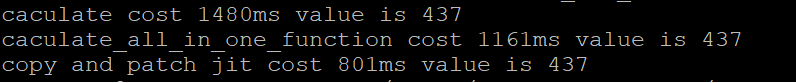

## 简介
copy and patch是一种jit技术，他的原理类似编译器的链接过程。对于一个已经编译好的obj文件，里面有生成的机器码还有一些需要重定位的符号。如果我们把需要的机器码拷贝出来，并把参数重定位进去那么就能得到一份可以运行机器码，相比于手写汇编来实现jit大大降低了难度。

这份代码实现了一份简易的demo。
## 代码结构
`arithmetical_expression_template.cpp` 模板代码主要用于生成jit需要的机器码

`generate_template.cpp` 负责编译模板代码并提取需要的机器码和重定位信息

`main.cpp` jit的代码和一份数学计算的代码

## 如何运行
需要安装clang
然后运行build.sh进行编译
```
bash build.sh
./main
```
## 运行结果

这里面有三个用例。

caculate是普通的数据计算的代码。

caculate_all_in_one_function是caculate的串行版本。

copy and patch jit是jit生成的代码。

其中jit的用例速度是普通的代码的1.8倍左右。
速度快的原因有多个。在使用jit的时候,可以跳过一些变量判断，同时不用查虚函数表，可以直接跳到函数地址。
另外从caculate_all_in_one_function可以看出这种循环处理也比串行处理慢,jit生成的代码同样也有这个优势。

## 生成的机器码内存情况

